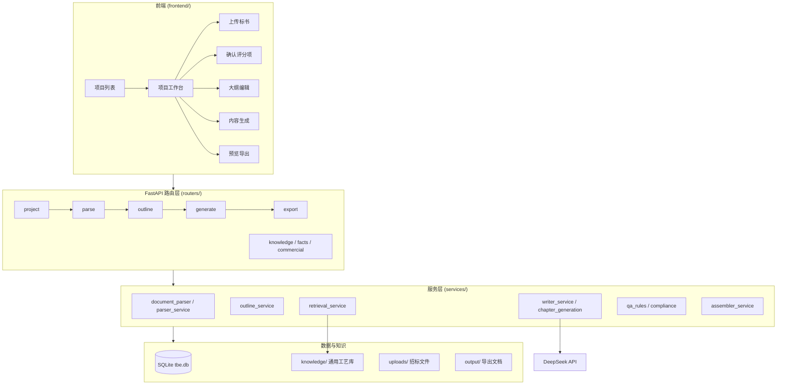

# Tech-Bid-Engine 项目宏观说明

> 版本：5.0.0 | 最后整理：2026-07-12

## 一、项目定位

**Tech-Bid-Engine** 是一套面向**工程技术投标**的**技术方案自动生成系统**。核心场景是：用户上传招标文件（PDF/DOCX），系统自动解析评分项与招标信息，经人工确认后生成大纲、逐章撰写技术标正文，最终导出格式规范的 Word 文档。

当前主要面向**电力工程**（变电站、线路、设备安装等），同时通过领域注册表扩展支持**市政、建筑、水利**等工程类型。

一句话概括：**「招标文件 → 结构化评分项 → AI 大纲 → RAG 增强写作 → 质检 → Word 导出」** 的端到端投标技术标生产流水线。

---

## 二、技术栈

| 层级 | 技术 |
|------|------|
| 后端 | Python 3.11+、FastAPI、Uvicorn、SQLAlchemy 2.x |
| 数据库 | SQLite（`tbe.db`，可配置路径） |
| LLM | DeepSeek API（OpenAI 兼容接口，可配置） |
| 文档解析 | PyMuPDF、pdfplumber、camelot-py、python-docx、RapidOCR |
| 检索 | BM25 + 向量嵌入（BGE-small-zh）+ RRF 融合 |
| 图表 | Graphviz（流程图/甘特图/组织架构图）、matplotlib |
| 前端 | React 18 + Ant Design 5（esbuild 打包为单文件 `app.js`） |
| 测试 | pytest（332 个测试用例） |

启动方式：运行 `start.bat`，默认访问 `http://localhost:3333`。

---

## 三、系统架构



架构特点：

- **单体应用**：FastAPI 同时托管 API 和静态前端，部署简单
- **状态机驱动**：项目按固定流程推进，每步有门禁校验
- **服务分层清晰**：路由薄、业务逻辑集中在 `services/`，Prompt 独立在 `prompts/`

---

## 四、核心业务流程

### 4.1 项目状态机

```
draft → parsing → confirming → planning → outline_locked → generating → done
```

| 状态 | 含义 | 可执行操作 |
|------|------|-----------|
| `draft` | 新建项目 | 上传招标文件 |
| `parsing` | 解析中 | 等待后台解析完成 |
| `confirming` | 待确认评分项 | 核对/编辑评分项、填写全局参数 |
| `planning` | 大纲策划 | AI 生成/编辑大纲、绑定知识库 |
| `outline_locked` | 大纲已锁定 | 启动批量内容生成 |
| `generating` | 生成中 | SSE 实时进度、单章重生成 |
| `done` | 完成 | 预览、编辑、导出 Word |

### 4.2 用户工作流（7 步）

| 步骤 | 名称 | 说明 | 是否可选 |
|------|------|------|---------|
| 1 | 上传标书 | 上传 PDF/DOCX 招标文件，自动解析评分项 | 必选 |
| 2 | 确认评分项 | 核对评分项与工程全局参数，确认刚性风险项 | 必选 |
| 3 | 商务标 | 编辑并确认商务/资格响应草稿，导出独立分册 | 可选 |
| 4 | 全局事实变量 | 维护技术方案引用的全局事实，保证全书数字、人名、品牌一致 | 可选 |
| 5 | 大纲编辑 | AI 深化大纲，可手动增删改章节与写作指导 | 必选 |
| 6 | 内容生成 | 按章节批量或单章生成技术方案正文 | 必选 |
| 7 | 预览与导出 | 审阅、修改章节内容并导出 Word 文档 | 必选 |

### 4.3 单章生成流水线（核心 AI 逻辑）

每章生成经过以下阶段（`writer_service.write_and_qa_chapter`）：

1. **上下文组装**（`chapter_context_service`）：项目参数、评分项、全局事实、知识库检索结果、写作指导
2. **内容规划**（可选）：长章节先由 LLM 规划要点再分段生成
3. **正文生成**（`chapter_generation_service`）：调用 DeepSeek 撰写 Markdown 正文
4. **硬质检**（`qa_rules`）：模板残留、字数、刚性要素、标准编号格式等
5. **软质检**（`humanizer_service`）：AI 套话检测与润色
6. **响应矩阵校验**（`response_matrix_service`）：评分项覆盖度
7. **落库 + 版本归档**（`chapter_version_service`）

章节审核状态：`init` → `generating` → `green`（通过）/ `yellow`（待优化）/ `red`（失败）

---

## 五、目录结构

```
biao/
├── main.py                 # FastAPI 入口，挂载路由与静态前端
├── config.py               # 环境变量与全局配置（LLM、检索、生成参数）
├── start.bat               # Windows 一键启动脚本
├── requirements.txt        # Python 依赖
│
├── routers/                # API 路由（12 个模块）
│   ├── project.py          # 项目 CRUD、元数据
│   ├── parse.py            # 文件上传、评分项解析与确认
│   ├── outline.py          # 大纲生成/编辑/锁定
│   ├── generate.py         # 内容生成、SSE 进度、章节编辑
│   ├── export.py           # Word/PDF 导出
│   ├── commercial.py       # 商务标轨道
│   ├── facts.py            # 全局事实变量
│   ├── knowledge.py        # 项目级知识条目
│   ├── settings.py         # LLM 配置
│   └── ...
│
├── services/               # 核心业务逻辑（40+ 模块）
│   ├── document_parser.py  # PDF/DOCX 底层解析
│   ├── parser_service.py   # 解析编排 + LLM 提取评分项
│   ├── outline_service.py  # 大纲 AI 生成与树操作
│   ├── writer_service.py   # 章节撰写门面
│   ├── retrieval_service.py # BM25+向量混合检索
│   ├── qa_rules.py         # 质检规则（核心质量保障）
│   ├── assembler_service.py # Markdown → Word 组装
│   ├── pipeline_runner.py  # 生成流水线编排（阶段/超时/重试）
│   └── ...
│
├── prompts/                # LLM Prompt 模板
│   ├── outline_prompt.py   # 大纲生成
│   ├── writer_prompt.py    # 章节写作
│   ├── extraction_prompt.py # 评分项提取
│   └── ...
│
├── db/
│   ├── models.py           # SQLAlchemy 数据模型
│   └── database.py         # 数据库连接与初始化
│
├── domains/                # 工程领域注册表
│   ├── domains.yaml        # 电力/市政/建筑/水利等领域配置
│   └── registry.py         # 领域解析与写作人设
│
├── knowledge/              # 跨项目共享工艺知识库
│   ├── _registry.yaml      # 知识分类注册表
│   ├── 主变安装/ GIS安装/ 继保调试/ ...
│   └── README.md
│
├── templates/              # 写作指南与大纲模板
│   ├── 电力EPC技术标写作指南.md
│   ├── 市政工程技术标写作指南.md
│   └── outlines/           # 预设大纲目录（变电站、线路等）
│
├── llm/
│   └── llm_client.py       # DeepSeek API 封装（重试/续写）
│
├── chart/
│   └── chart_service.py    # 流程图/甘特图/组织架构图渲染
│
├── frontend/               # React 前端
│   ├── index.html
│   ├── app.js              # esbuild 打包产物
│   └── src/                # JSX 源码
│       ├── app.jsx
│       ├── modules/        # 按功能划分的 UI 模块
│       └── api/            # API 客户端
│
├── tests/                  # 332 个 pytest 测试
└── scripts/                # 工具脚本（知识库导入、模型下载等）
```

---

## 六、核心数据模型

| 表名 | 用途 |
|------|------|
| `projects` | 项目基本信息（名称、电压等级、工期、地点、状态） |
| `tech_requirements` | 从招标文件解析的评分项（分值、风险项、刚性要素） |
| `tech_outline` | 大纲树（层级、绑定知识库、生成内容、审核状态） |
| `global_facts` | 全局事实变量（保证全书数字/名称一致） |
| `knowledge_items` | 项目级知识条目（参考标书片段） |
| `knowledge_chunks` | 通用知识库分片（BM25/向量索引） |
| `chapter_versions` | 章节内容版本历史 |
| `commercial_sections` | 商务标章节（独立轨道，不走 LLM 逐章生成） |

---

## 七、AI 与知识增强

### 7.1 LLM 使用场景

- **招标文件解析**：提取评分项、招标公告信息、矛盾检测
- **大纲生成**：基于评分项 + 领域模板深化章节结构
- **章节写作**：按写作指导 + 检索知识生成正文
- **内容规划**：长章节要点拆分
- **选区改写**：用户选中段落按指令重写
- **知识库导入**：长文自动切片（`scripts/import_knowledge.py`）

### 7.2 双层知识库

| | `knowledge/` 通用库 | 项目级 `KnowledgeItem` |
|---|---|---|
| 范围 | 跨项目共享工艺知识 | 单项目参考资料 |
| 存储 | txt 文件 + git | SQLite 数据库 |
| 检索 | BM25 + 向量 RRF 融合 | 项目内检索 |
| 绑定 | 大纲章节 `bound_folder` | 知识库抽屉上传 |

当前通用库覆盖 5 类电力工艺：主变安装、GIS 安装、继保调试、接地网敷设、电缆敷设。

### 7.3 多领域支持

`domains/domains.yaml` 注册以下工程领域：

| 领域 | 标准前缀 | 典型关键词 |
|------|---------|-----------|
| 电力工程 | GB, DL, QGDW, JGJ, NB | 变电站、输电线路、kV |
| 市政工程 | GB, CJJ, JGJ | 市政道路、给排水、管廊 |
| 建筑工程 | GB, JGJ | 房屋建筑、主体结构 |
| 水利工程 | GB, SL, DL | 水利枢纽、堤防、灌溉 |
| 其他 | GB, JGJ | 通用兜底 |

每个领域有独立的写作人设（`identity_prompt`）、指南文件、标准编号前缀。

---

## 八、质量保障体系

`qa_rules.py` 是质量核心，涵盖：

- **模板残留检测**：`XXX公司`、`【待补充】` 等占位符
- **刚性要素校验**：评分项要求的必答要素是否覆盖
- **字数控制**：按评分页数估算目标字数，允许 ±25% 浮动
- **标准编号格式**：GB/DL/JGJ 等规范引用检查
- **章节类型适配**：描述性章节 vs 施工方案章节不同规则
- **矛盾检测**：全局参数与正文内容一致性
- **AI 套话检测**（`humanizer_service`）：识别并标记常见 AI 写作痕迹

章节颜色标记：**绿**（通过）、**黄**（软问题待优化）、**红**（硬问题需重生成）

---

## 九、导出能力

`assembler_service.py` 将 Markdown 章节组装为专业 Word 文档：

- 封面、目录（自动更新域）
- 多级标题编号（decimal / chapter_cn / outline_mixed）
- Markdown 表格、列表、高亮标记渲染
- 内嵌图表：`[flow:...]`、`[gantt:...]`、`[org:...]` 等 DSL 转 Graphviz 图片
- 暗标模式：自动脱敏封面与页眉
- 商务标独立分册导出

---

## 十、前端架构

- **无 SPA 框架**：React + Ant Design，通过 esbuild 打包为单个 `app.js`
- **双视图**：项目列表 ↔ 项目工作台
- **工作台侧边栏**：7 步工作流导航，状态驱动自动跳转
- **实时进度**：生成阶段通过 SSE（`sse_manager`）推送章节状态

主要 UI 模块：

| 模块 | 功能 |
|------|------|
| `ParseProgressPanel` | 解析进度 |
| `TenderDetailPanel` / `RequirementsTable` | 评分项确认 |
| `OutlineEditor` / `OutlineTreeEditor` | 大纲树编辑 |
| `GenerationPanel` | 批量/单章生成 |
| `PreviewExport` | 预览与 Word 导出 |
| `CommercialPanel` | 商务标编辑 |
| `GlobalFactsPanel` | 全局事实变量 |

---

## 十一、测试覆盖

332 个 pytest 测试，主要覆盖：

| 测试文件 | 覆盖领域 |
|---------|---------|
| `test_qa_rules.py` (29) | 质检规则 |
| `test_writer_service.py` (13) | 章节写作 |
| `test_p4_generation_quality.py` (11) | 生成质量 P4 |
| `test_retrieval_service.py` (11) | 知识检索 |
| `test_outline_service.py` (11) | 大纲服务 |
| `test_assembler_service.py` (13) | Word 组装 |
| `test_compliance_service.py` (13) | 合规检查 |
| `test_document_parser.py` | 文档解析 |
| `test_tender_detail_service.py` | 招标详情 |
| `test_commercial_router.py` | 商务标 API |

运行测试：

```bash
venv\Scripts\python -m pytest tests
```

---

## 十二、配置要点

`.env` 关键配置项（参考 `.env.example`）：

| 变量 | 默认值 | 说明 |
|------|--------|------|
| `DEEPSEEK_API_KEY` | — | LLM API 密钥（必填） |
| `API_PORT` | 3333 | 服务端口 |
| `EMBEDDING_ENABLED` | 1 | 是否启用向量检索 |
| `GENERATION_CONCURRENCY` | 3 | 并发生成章节数 |
| `TARGET_PAGES_DEFAULT` | 40 | 默认目标页数 |
| `MAX_QA_RETRY` | 2 | 质检失败重试次数 |
| `LONG_CHAPTER_WORD_THRESHOLD` | 1800 | 长章节分段生成阈值 |
| `HEADING_NUMBERING_PRESET` | decimal | 标题编号样式 |

外部依赖：

- **Graphviz**：流程图/组织架构图渲染（`winget install Graphviz.Graphviz`）
- **Ghostscript**：部分 PDF 解析
- **中文字体**：Word 导出排版

---

## 十三、快速上手

```bash
# 1. 克隆项目后，运行启动脚本（自动创建 venv、安装依赖、编译前端）
start.bat

# 2. 配置 LLM 密钥（首次运行会自动从 .env.example 复制）
# 编辑 .env，填入 DEEPSEEK_API_KEY

# 3. 浏览器访问
http://localhost:3333

# 4. 创建项目 → 上传招标文件 → 按工作流逐步操作
```

知识库维护见 `knowledge/README.md`。

---

## 十四、总结

| 维度 | 评价 |
|------|------|
| **定位** | 工程技术投标技术标 AI 写作平台，电力工程为主、多领域可扩展 |
| **成熟度** | V5.0，332 测试，完整端到端流程，生产可用形态 |
| **技术亮点** | 状态机门禁、RAG 混合检索、多层质检、SSE 实时进度、Word 专业导出 |
| **架构风格** | 单体 FastAPI + SQLite，服务分层清晰，Prompt 与业务解耦 |
| **扩展点** | 领域注册表、知识库 YAML 配置、大纲模板、质检规则 |
